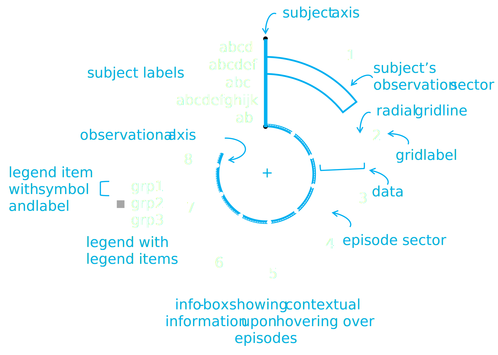
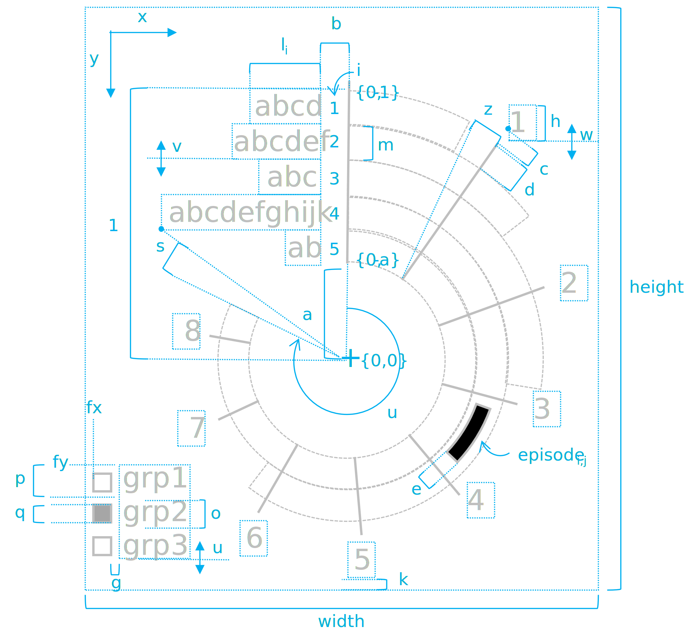
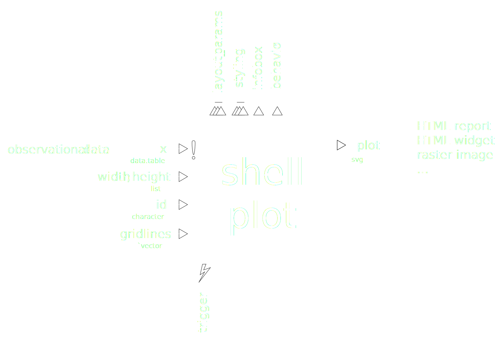
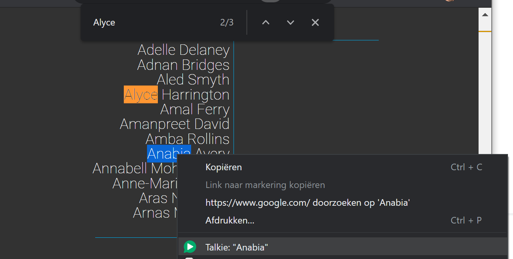

```{r setup, include=FALSE}
library(knitr)
library(magrittr)
library(data.table)

opts_chunk$set(echo = TRUE, message = FALSE, warning = FALSE,
  comment = FALSE, cache = FALSE)

palette(c("#00B0F0", "orange"))

fig_cap <- "txt/captions.md" %>%
  fread(encoding = "UTF-8", sep = "\t", header = FALSE, skip = 2) %>% 
  extract2(1)

source("shell/shell.r")
```

```{r end-result-cancer-tx, echo=FALSE, results="asis"}
canc <- fread("dat/cancer_tx.tsv", encoding = "UTF-8",
  stringsAsFactors = TRUE)
infobox_template <- "html/cancer_tx.html"

measure_breaks <- c(-Inf, .5, 4, 70, 150, Inf)
labels <- c("Zero", "Low", "Medium", "High", "Unbound")

canc[, Group := Measure %>%
    cut(breaks = measure_breaks, labels = labels) %>%
    addNA(ifany = TRUE)]

layout <- layout_default
layout$legend <- data.table(
  Id = labels %>% c(NA),
  Label = labels %>% c("(missing)"),
  Color = colorRampPalette(c("steelblue", "orange"))(5) %>% 
    c("lightgrey"))
layout$unit = "yr"
layout$legend_title <- "Cell count"

canc %>%
  shell_plot(
    gridlines = 0:8,
    layout = layout,
    infobox_template = infobox_template) %>%
  cat
```

<div class="caption">`r fig_cap[1]`</div>

# Quick start

I have not created an R package for this plot yet. I would love to incorporate some feedback first so as to improve its usability and make it more robust and applicable in a wider range of real-life scenarios. For now you can follow the steps below:

- Download and install [R](https://www.r-project.org/) and [RStudio](https://www.rstudio.com/)
- Prepare a longitudinal `data.table` so that each row contains an episode with a `Subject` and with numeric features called `Start` and `End`.
- Decide on which feature to determine the coloring of the episode sectors and place the calculated color for each episode in the feature named `Group`.
- Download or clone the Shell plot repository and copy the `shell` subfolder as an immediate subfolder of your project folder (otherwise adjust respective paths in the main functions default arguments).
- Generate the HTML containing the SVG, JavaScript and CSS of the shell plot like so:

  ```r
  my_dt %>% shell %>% cat
  ```
- Either render the HTML directly in RMarkdown or copy-paste it into your own HTML page. 

# Introduction

Around the year 2015, I devised a plot type that I baptised the _shell plot_ (_Figure 1_). It allows for pattern discovery in longitudinal data with highly variable and positively skewed observation periods. One example that we are going to demonstrate here is the observational study where many _patients_ (the subject) are being followed during treatments (events) ranging from a couple of days to several years. Another example could be the analysis of volcano eruption episodes (subject) during which all kinds of specific events occur such as explosions, fumarole activity, ash expulsion, &hellip; that deserve temporal analysis. The observational axis would typically represent the time dimension but could also represent distance or another quantity altogether. We will discuss some example at the end of this article.

In comparison with the older versions of this plot, I decided to make this one vector-based, to write it in pure HTML and to add interactivity such as zooming and showing details upon hovering. I went to the trouble of having most parameterization automated so that only a minimal user input is required, while still allowing endless flexibility in the layout and styling part.

# Building the plot from scratch

## Terminology

Let us take the time to think this through, because although it looks as simple as converting Cartesian coordinates to polar ones, there is a little bit more to it. First, to agree on the terminology used, I drew up _Figure 2_:

```{r terminology, echo=FALSE, fig.cap=fig_cap[2]}

```

## Layout parameterization

Next, let us think about how to parameterize the layout. Details are shown in _Figure 3_. We begin by centering our plot around the ${x, y}$-coordinate ${0, 0}$ and by confining the radius range of the annuli sectors containing the data to $[a, 1]$, where $a$ is the size of the hole in the middle of the plot. Next we need to calculate the lengths of the labels $l_i$ based on the font used, the font size and the font style. These label-lengths allow us to determine the maximum allowed sector angle $\alpha_{max}$ so as to avoid that data sectors overlap with the subject labels. Next, we draw the outer observation sectors that cover the complete observation-period per subject and then we draw the episode sectors. The distribution of the data determines the length of the radial grid lines and finally, the positions of all the elements on the plot determine the framing of the view port. Now that the parameterization is in place, we can draw the process diagram as shown in _Figure 4_.

```{r parameterization, echo=FALSE, fig.cap=fig_cap[3]}

```

```{r process, echo=FALSE, fig.cap=fig_cap[4]}

```

# Methodology

## Data

At some point we will need data. However, let us first load our libraries. There are two libraries that I use all the time:

> example.Rmd

```{r exm-dev-01}
library(magrittr)
library(data.table)
```

The simplified and pseudonymized dataset of cancer treatments looks like this (only first few records shown):

> example.Rmd

```{r exm-dev-02}
epi <- fread("dat/cancer_tx.tsv", encoding = "UTF-8",
  stringsAsFactors = TRUE)
epi %>% head(10) %>% kable
```

`Start` and `End` are the start and end times of the subject's treatment episode expressed in years after initial admission, whereas `Start_Day` and `End_Day` were calculated by dividing the former by 365.2425. The features `Line` to `Regime` correspond to the treatment descriptors that you would typically find in oncology. `Measure` represents some quantifiable outcome measure. Finally, the `Age` is a fake feature to demonstrate the use of subject-specific data. It was drawn as `epi[, Age := rnorm(1, 45, 15) %>% round, Subject]`.

## Personalizing subject identifiers

`Subject` names are fake and are derived from the [Quick Name Generator](https://www.name-generator.org.uk/quick/) so as to remind ourselves that we are dealing with real people even if the data has been anonymized beyond recovery. If you are in a similar situation in which you want to protect the people's identity while still reminding anyone that you are dealing with people instead of records or numbers, then you can collect a sufficiently large set of unique names (first and/or last names dependent on the number needed) in an headed tab-separated file `names.tsv`^[I tend to avoid comma-separators where possibly for, I hope, the obvious reasons. Whoever has started the idea that a comma would be a good separator is a fool anyway] and do something along these lines:

> example.Rmd

```{r exm-dev-03, eval=FALSE}
names <- fread("names.tsv", sep = "/t") # One feature called 'Name'
dat[, Subject := names$Name[Subject_ID %>% as.factor %>% as.numeric]
```

Note that the `sep = "\t"` argument is only needed here because the file consist of a single feature and `fread` might be confused about what separator to choose, especially if the names you collected from some online generator contains comma values.

## Without the shell plot&hellip;

The summary below and _Figure 5_ show that the accumulated observation time per Subject typically varies greatly (from 0.066 years = 24 days to more than 8.5 years). Because we have such a wide range of observation periods among subjects, it becomes hard to keep the overview. Log-transforming the time axis is not ideal because it hinders interpretation and because there might be statistical objections. That is where the idea arose to bend the observational axis into a circle while keeping the subjects sorted from shorter to longer observation periods.

```{r without-shell, echo = FALSE, fig.height = 14, fig.cap=fig_cap[5], comment=""}
par(mar = c(5, 6, 3, 2), bg = "#323232", fg = "white")

tx_times <- epi[, .(TX_Time = c(End, Start) %>% range %>% diff),
  Subject][order(TX_Time)]

tx_times

tx_times[, barplot(rev(TX_Time), names.arg = rev(Subject), las = 2,
  cex.names = .4, col = 1, border = NA, horiz = TRUE,
  col.axis = "white")] -> tmp
```

## Shell function signature

Based on the process diagram shown above, we can write out the signature and usage of `shell` function:

> shell.R

```{r signature, eval=FALSE}
shell_plot <- function(episodes, width, height, layout, style, id,
  gridlines = NULL, shell_template = "shell/svg/shell_template.svg",
  infobox_template = "shell/html/infobox-template.html",
  javascript = "shell/js/shell.js", css = "shell/css/shell.css") {
  
  # Code goes here
}

epi %>% shell
```

## The SVG template

In the next paragraph, we will start with plotting the subject labels. But for that, we first need a plotting device. Instead of using the base plotting system of R, I decided here to generate SVG code directly instead. In order to keep the plot function flexible, adjustable and configurable, I will utilize templates and work with the `whisker` package which implements [mustache](https://mustache.github.io/). Below is the first version of the SVG template for our plot:

> shell_template.svg

```{html shell-template, code=readLines("svg/shell_template_0.svg"), eval = FALSE}
```

The `width` and `height` of the viewport are variable and must be completed, hence the double curly braces. In this tutorial, we will be using the chunk options to set these variables with `width <- opts_current$get("out.width")` and `opts_current$get("out.height")`, respectively (see below). Mind that the `viewbox` is currently being hard coded. Later, we will calculate these values from the content. The numbers `.7 -1.1 1.4 2.2` are the left, top, width and height of the viewing window and are in the user units of the SVG element. Next we see a group tag `<g>` in which I temporally added some guidelines to help me positioning graph element during development. I will remove these later. Finally, we see a whisker loop structure that will iterate over subjects (`{{#subjects}}<loop body>{{/subjects}}`). For each subject, we will be gathering the subject's identifier (`Subject`) for the label text as well as the `Lab_X` and `Lab_Y` features for the proper placement of the labels.

## Loading width and height from chunk options

We will soon load and complete the SVG template, but for that we will need some data to complete. As mentioned above, we load the `out.width` and `out.height` chunk options into the variables `width` and `height`, respectively. First, we define the RMArkdown chunk as such:

```` ```{r shell_dev_02, out.height="800px", out.width="500px"} ````

and then we acces these options:

> Example.Rmd

```{r accesing-chunk-info, out.height="450px", out.width="300px"}
width <- opts_current$get("out.width")
height <- opts_current$get("out.height")
```

## Loading layout options from the YAML configuration file

Simply save a file named `config.yaml` in the root folder:

> config.yaml

```yaml
default:
  layout:
    a: .10  # Size of the central hole in the plot in user units (UU)
    b: .02  # Space between subject labels and subject axis (UU)
```

Remember that `a` represents the radius of the central hole in the middle of the graph and `b` is the relative distance between the labels and the subject axis (see _Figure 3_ for details). The `config` packages makes it really easy to read from and write to YAML configuration files.

> shell.R

```{r loading-config}
library(config)

config <- config::get(file = "shell/config.yaml")

layout <- config$layout
```

## Using `whisker` for templating

In order to complete the above template, we reference the `whisker` package. With the function `base::readchar()` we can allocate the template to the string `shell_template`: 

> shell.R

```{r exm-dev-04}
library(whisker)

shell_template <- "svg/shell_template.svg" %>%
  readChar(., file.info(.)$size)
```

We are now ready to adjust the `shell()` function so as to print the subject labels:

> shell.R

```{r exm-dev-06, results="asis"}
shell_plot_01 <- function(episodes, layout) {
  layout$n <- episodes$Subject %>% uniqueN
  layout$m <- (1 - layout$a) / layout$n
  
  subjects <- episodes[, .(
    Episode_Count = .N,
    Lab_X = -layout$b,
    Lab_Y = .GRP * layout$m - 1), Subject] %>%
    rowSplit %>% unname
  
  out_data <- list(
    width = width,
    height = height,
    subjects = subjects,
    layout = layout)
  
  out <- whisker.render(
    template = shell_template,
    data = out_data)

  return(out)
}
```

## Dynamically setting font size

An added advantage about plotting directly to SVG, is that one can easily scale texts. Here, the font size of the labels is set to the value $m$ (see _Figure 3_ for more details):

$$m=\frac{(1-a)}{n}$$

Within R, this task is trickier as text height in R using the `base::strheight()` function is based on the height of the capital letter 'M' (see `?strheight` for details on this). 

## Completing a template from a data table

Notice the use of `data.table` in the above code snippet:

> shell.R

```{r exm-dev-07, eval=FALSE}
[...]

subjects <- episode[, .(
  Episode_Count = .N,
  Lab_X = -layout$b,
  Lab_Y = .GRP * layout$m - 1), Subject] %>%
  rowSplit %>% unname

[...]
```

By now, data tables are well established I assume, but just in case: the above translates to:

_Take the episodes data table, perform no filtering on it (nothing before the first comma), group by subject (third parameter inside the `[]`) and then aggregate the rows in that group (containing the episode for that subject) into a single row with the features `Episode_Count` containing the number of episodes (using `data.table`'s special variable `.N`) and the label positions `Lab_X` and `Lab_Y`._

The `whisker::rowSplit()` function is a convenience function to split a `data.frame`, `data.table` or `matrix` object into a list of lists allowing for the whisker loop structure inside the template to work properly. In the variable `out_data`, we gather all the data to be processed by whisker to complete the template. Notice how the dot in `{{layout.a}}` (see template above) allows the reference of children (and grandchildren, etc&hellip;) within a complex object.

## Plotting the subject labels

All that we are left to do is to test whether the subject label are plotted in the correct order, in the correct position and with the dynamically adjusted font size:

> example.Rmd

```{r labels-01, results="asis"}
canc %>% head(200) %>% shell_plot_01(layout) %>% cat
canc %>% head(500) %>% shell_plot_01(layout) %>% cat
```

<div class="caption">`r fig_cap[6]`</div>

Again, if you haven't been reading the above and your are freaking out because you fear for the privacy of the people, the names are fake, see above for details on this. I am showing the labels immediately in their final font family (here, Google's Roboto). Instead of the on-element attribute, I used CSS for that:

> css/shell.css

```{css shell-css-01, code=readLines("css/shell-01.css"), eval=FALSE}
```

If you are a pixel fucker, as I am, you might have noticed a slight shift in the subject identifiers respective to the guidelines. I will be adding a parameter to account for a relative shift for this and other `<text>` elements as shown in _Figure 3_.

## Searchable text

Because the plot is being generated as SVG, the text is fully searchable, indexable, CSS stylable, Javascriptable, etc&hellip; (see _Figure 7_).

```{r searchable, echo=FALSE, fig.cap=fig_cap[7]}

```

## Plotting an annulus sector

Let us start plotting the visual elements representing the data. In a shell plot, the subject's observation periods as well as the episodes it contains are being represented by annulus sectors as shown in _Figure 2_. In general, an annulus sector is being parameterized by:

- center ($c_x$ and $c_y$)
- inner radius ($r_{inner}$)
- outer radius ($r_{outer}$)
- start angle ($\alpha_{min,j}$)
- end angle ($\alpha_{max,j}$)

However, we will have to manually construct this shape using the SVG `<path>` element. Suppose we would want to draw the upper arc of the observation highlighted in _Figure 2_ (with identifier `abcdef`) and we assume that the end angle for this sector is 50&deg;, then we would create something like this (look at second group, the first is for the guidelines):

> shell_template.svg

```{html svg-arc-code, code=readLines("svg/shell_template_1.svg"), eval=FALSE}
```

The above reads as Move to $\{0.000, -0.860\}$ (all numbers in user units as per _Figure 3_), where $-0.860$ comes from:
$$-0.860=-r_{outer, 2}=-1 \cdot \left[a+(1-a)\frac{(n-i+1)}{n}\right]=-1 \cdot \left[0.3+(1-0.3)\frac{(5-2+1)}{5}\right]$$

, then draw an elliptical Arc with radius $r_{outer, 2}=0.860$ (twice because $r_x=r_y$ are axes of an ellipse and we need a circle), along a $\Delta\alpha$ of 50&deg;, taking the shorter of both arcs (because $\Delta\alpha<\pi$ as indicated with `0`), that moves clockwise (`1`) to the point $\{0.659, -0.553\}$ where $0.659=0.860\cdot cos(90-50)$ and $-0.553=-0.860\cdot sin(90-50)$ (because of the vertically flipped coordinate system of SVG). Here is the result:

```{r svg-arc-test, results="asis", echo=FALSE}
"svg/shell_template_1.svg" %>%
  readChar(., file.info(.)$size) %>% 
  cat
```

<div class="caption">`r fig_cap[8]`</div>

From drawing an arc, it is a small step to drawing the annulus sector. Here is the adjusted SVG template:

> shell_template.svg

```{html svg-arc-code, code=readLines("svg/shell_template_2.svg"), eval=FALSE}
```

And here is some test code to complete the template based on the start angle (100&deg;), the end angle (260&deg;), the subject index (2), the total number of subjects (5):

> shell.R

```{r svg-sector-test, results="asis"}
template <- "svg/shell_template_2.svg" %>%
  readChar(., file.info(.)$size)
out_data <- list()

# Knowns
angle_start <- 100
angle_end <- 260
i <- 2
n <- 5

# Calculated
out_data$Delta_Angle <- angle_end - angle_start
out_data$Large_Arc <- 1 * (out_data$Delta_Angle > 180)
out_data$R_Outer <-
  layout_default$a +
  (1 - layout_default$a) *
  (n - i + 1) / n
out_data$R_Inner <-
  layout_default$a +
  (1 - layout_default$a) *
  (n - i) / n
out_data$X_Start_Outer <- (
  out_data$R_Outer *
  cos((90 - angle_start) / 180 * pi)) %>%
  round(3)
out_data$Y_Start_Outer <- (
  -1 * out_data$R_Outer *
  sin((90 - angle_start) / 180 * pi)) %>%
  round(3)
out_data$X_End_Outer <- (
  out_data$R_Outer *
  cos((90 - angle_end) / 180 * pi)) %>%
  round(3)
out_data$Y_End_Outer <- (
  -1 * out_data$R_Outer *
  sin((90 - angle_end) / 180 * pi)) %>%
  round(3)
out_data$X_Start_Inner <- (
  out_data$R_Inner *
  cos((90 - angle_start) / 180 * pi)) %>%
  round(3)
out_data$Y_Start_Inner <- (
  -1 * out_data$R_Inner *
  sin((90 - angle_start) / 180 * pi)) %>%
  round(3)
out_data$X_End_Inner <- (
  out_data$R_Inner *
  cos((90 - angle_end) / 180 * pi)) %>%
  round(3)
out_data$Y_End_Inner <- (
  -1 * out_data$R_Inner *
  sin((90 - angle_end) / 180 * pi)) %>%
  round(3)

template %>%
  whisker.render(data = out_data) %>% 
  cat
```

<div class="caption">`r fig_cap[9]`</div>

With this beautiful smile we have overcome the biggest technical hurdles. We will now move to the interactivity aspect.

## Hover info

As promised, I am going to make the plot interactive. I will test this interactivity on a single shape (the one we prepared in previous paragraph). Suppose I would like, whenever I hover over the shape, the name of the subject to appear in an information box below. As it is good practise to separate the HTML elements from their styling and from their actions. We start by defining a piece of HTML template that is to be  completed with the data:

> infobox-template.html

```{html infobox-template-01, code=readLines("html/infobox-template-01.html"), eval=FALSE}
```

The only piece of information to complete this template, in this case, is the subject's identifier `Subject`. We know how to complete a template using `whisker`. However, this HTML snippet is to be complete not during R's compile time but on the fly and so needs to reside on the client. So, where does the data come from? There are many options to store the data. Probably the slickest way to store the data client-side is by using the storage options of your browser. However, we are going to store the data inside attributes of the object we are hovering over. Having the data attached to its source makes a lot of sense, but may not be the most memory-efficient way. We are going to store the headers separately from the data values to avoid repetition, but even then we would be wasteful whenever we need multiple HTML elements types to respond to a mouse hovering.

We now wrap the svg inside a division add the `infobox-03` element to hold the completed data:

> shell_template.svg

```{html shell-template-3, code=readLines("svg/shell_template_3.svg"), eval=FALSE}
```

Notice the addition of the `data-subject-name` and `class` attributes on the `path` element as well as the division at the bottom which will be containing the completed template upon hover. Obviously, here one needs to work with the `id` attribute instead of the `class` attribute as we want to be able to have multiple shell plots on a HTML page each connected to their specific information box. So we have the data template, we have the data and we have the information box recipient. Now, we only need to write some Javascript code to handle the template completion upon hover: 

> shell.js

```{js hover-01, code=readLines("js/hover-01.js")}
```

Notice that I have `mouseenter` and `mouseleave` events declared as well as the click event to store the current data to the user's clipboard.

```{r hovering-test-01, results="asis", echo=FALSE}
"svg/shell_template_3.svg" %>%
  readChar(., file.info(.)$size) %>%
  whisker.render(data = out_data) %>% 
  cat
```

<div class="caption">`r fig_cap[10]`</div>

```{r hovering-test-02, results="asis", echo=FALSE}
"html/infobox-template-01.html" %>%
  readChar(., file.info(.)$size) %>% 
  cat
```

If you click the sector, the following text should be placed on your clipboard (try in browser as it may not work in your RStudio viewer):

```{txt copy-data-functionality}
{"Subject":"abcdef"}
```

## Styling and legend

Within the R landscape I came across many ways to provide colors for a color scale. I have been thinking about the best way to implemented this for the shell plot and I came to the following conclusions:

- Use the YAML configuration file for generic styling
- Use CSS for dynamic or specialist styling
- Provide grouping information as a factored feature in `x`

For example, suppose we want to define the color of the episode sectors based on the binned version of the `Measure` feature, we can prepare the data like so:

> example.Rmd

```{r grouping}
measure_breaks <- c(-Inf, 2, 150, Inf)
labels <- c("Low", "Medium", "High")

epi[, Group := Measure %>%
    cut(breaks = measure_breaks, labels = labels) %>%
    addNA(ifany = TRUE)]

epi$Group %>% table
```

With a properly defined factored feature, it becomes really easy to draw a legend. Here is some test code:

> example.Rmd

```{r color-test-01, results="asis"}
library(colorspace)

cols_bord <- epi$Group %>%
  uniqueN %>%
  add(-1) %>%
  rainbow %>% 
  c("grey") %>% 
  darken(.3)
cols_body <- epi$Group %>%
  uniqueN %>%
  add(-1) %>%
  rainbow %>% 
  c("lightgrey")

out_data <- epi[order(Group), .(
  Lab_Y = -.9 + (.GRP) * .1,
  Symbol_Y = -.95 + (.GRP) * .1,
  Symbol_Stroke_Color = cols_bord[.GRP],
  Symbol_Color = cols_body[.GRP]), .(Label = Group)] %>% 
  rowSplit %>% unname

out_data = list(
  legend = out_data,
  Lab_Color = "#646464",
  Lab_Dim = .08,
  Symbol_Dim = .05,
  Symbol_X = -.5,
  Lab_X = -.4,
  Symbol_Stroke_Width = .01
  )

"svg/shell_template_4.svg" %>%
  readChar(., file.info(.)$size) %>%
  whisker.render(data = out_data) %>% 
  cat
```

<div class="caption">`r fig_cap[11]`</div>

## Label lengths

The last piece of the puzzle are the radial grid lines, including the subject axis. First, we need to calculate the maximum possible angle $\alpha_{max}$ so that the observation sectors do not overlap with the subject labels. Then we can calibrate the observation axis so that $t_{max}$ corresponds to $\alpha_{max}$. Finally, we can use the `pretty` functionality of R so that the grid lines get logically-separated along the range of the observations axis.

To calculate $\alpha_{max}$, we first need the computed lengths of the subject labels ($\ell_i$). I tried to use `strwidth()` and `strheight()` functions but later switched to writing my own function to measure the length of a label. The font family determines the width of the printed font, so we need to take that into consideration. As shown above in the CSS file, I have used the Roboto font but obviously, this will become an option. First, we look at the function to calculate label widths:

> shell.R

```{r label-widths, eval=FALSE}
library(systemfonts)

get_label_widths <- function(labels, font_height, style) {
  labels <- labels %>% as.character
  glyphs <- labels %>% strsplit("") %>% unlist %>% unique
  glyph_details <- glyph_info(glyphs, style$font$family) %>% as.data.table
  glyph_ar <- glyph_details[,
    .(Glyph = glyph, Width = x_advance, Height = height)]
  
  setkey(glyph_ar, "Glyph")
  
  label_width <- function(label) {
    label_ar <- glyph_ar[label %>% strsplit("") %>% 
        unlist, sum(Width) / max(Height)]
    
    return(font_height * label_ar)
  }

  label_widths <- labels %>%
    lapply(label_width) %>%
    unlist
  
  return(label_widths)
}
```

After converting the labels, which might be stored as a factor, to a character vector, we extract all used characters with `%>% strplit("") %>% unlist`. Then we query Roboto's glyph table using `systemfonts::glyph_info()` function for these particular characters and store the resulting aspect ratios in the variable `glyph_ar`. Given a word and the font height (i.e. font size in user units), we can then easily calculate the width of a label as it would be printed on a screen in a particular font family and in a particular font size. Mind that, unlike for `strwidth()` and `strheight()` we do not actually need to plot the string, which saves a lot of resources (I may actually talk about green computing on another occasion).

> shell.R

```{r label-widths-01, comment=""}
subject_names <- epi$Subject %>% levels %>% extract(1:13)
font_size <- (1 - layout_default$a) / length(subject_names)
style_01 <- list(font=list(family = "Roboto"))

(predicted <- subject_names %>%
  get_label_widths(font_size, style_01))
```

In case you want to reproduce this code and not want to install Roboto on your windows system, you can download the font, say in the `fnt` subfolder, import it and check its availability:

> example.Rmd

```{r roboto-load, eval=FALSE}
library(extrafont)

font_import(paths = "fnt", prompt = FALSE)
fonts() %>% grep("Roboto", ., value = TRUE) %>% head
```

## Radial grid lines

Now that we have the lengths of the printed labels, we can continue to calculate the max angle of the observation axis:

$$\alpha_{max}=min\left[atan2\left(-(\ell_i+b),\frac{(i-n)(1-a)}{n}\right)-a\right]-s$$

where $\ell_i$ is the cumulative maximum of $l_i$. Notice how I vectorize `atan2` to ease programming:

> shell.R

```{r alpha_max}
n <- length(predicted)
l_i <- cummax(predicted %>% rev) %>% rev
i <- 1:n
s <- pi / 12

x <- -(l_i + layout_default$b)
y <- (i - n) * (1  - layout_default$a) / n - layout_default$a

atan3 <- Vectorize(atan2) # Sorry, I couldn't resist

(alpha_max <- 5 * pi / 2 - min(atan3(-y, x)) - s)
```

, which, in case you do not like radians, roughly corresponds to $\frac{`r janitor::round_to_fraction(alpha_max / pi, 8) * 8`\pi}{8}$ or `r round(alpha_max * 180 / pi)`&deg;.

With $\alpha_{max}$ known, we can finally draw the axial grid lines. I collect the max observation years of the top 200 rows of data (which corresponds to the 13 label names plotted before) and use `pretty` to find a nice distribution of angles:

> shell.R

```{r gridlines_test}
a <- .3
c <- .05
d <- .02

max_obs_years <- epi %>% head(200) %$% End %>% max
years_to_rad <- function(x) {
  (5 * pi / 2) - (x / max_obs_years * alpha_max)
}

obs_axis <- data.table(
  Label = c(0, max_obs_years) %>%
    pretty %>% 
    extract(. < (max_obs_years)))

obs_axis[, Axis_Angle := Label %>% years_to_rad]
obs_axis[, Gridline_Start_X := a * cos(Axis_Angle)]
obs_axis[, Gridline_Start_Y := -a * sin(Axis_Angle)]
obs_axis[, Gridline_End_X := (1 + d) * cos(Axis_Angle)]
obs_axis[, Gridline_End_Y := -(1 + d) * sin(Axis_Angle)]
obs_axis[, Axis_Label_X := (1 + d + c) * cos(Axis_Angle)]
obs_axis[, Axis_Label_Y := -(1 + d + c) * sin(Axis_Angle) + 0.025]
obs_axis[, Anchor := ifelse(abs(Axis_Label_X) < a, "middle",
  ifelse(Axis_Label_X > 0, "start", "end"))]
```

And here is the result:

```{r radial-gridlines, results="asis"}
out_data = list(
  grid_lines = obs_axis %>% rowSplit %>% unname,
  layout = list(m = .053),
  Gridline_Color = "pink",
  Gridline_Width = .006,
  Unit = "yr"
  )

"svg/shell_template_5.svg" %>%
  readChar(., file.info(.)$size) %>%
  whisker.render(data = out_data) %>% 
  cat
```

<div class="caption">`r fig_cap[12]`</div>

Not shown here is the shortening of the grid lines based on the data as indicated in _Figure 3_.

## Putting it all together

You can find the final solution on [my Github page](www.github.com/ddhaese/Project_Shellplot).

## Examples

### Conflicts

The [Uppsala Conflict Data Program (UCDP)](https://ucdp.uu.se/downloads/) provides global data about the wars and other forms of armed conflicts that have raged during the past 30 years.

> conflicts.html

```{r conflicts, results="asis"}
conflicts <- fread("dat/conflicts.tsv", sep = "\t")

breaks <- c(-Inf, 1, 2, 4, 8, Inf)
labels <- c("Very low", "Low", "Medium", "High", "Very high")

conflicts[, Group :=
    Casualties_Estimate %>% log %>%
    cut(breaks = breaks, labels = labels)]

layout <- copy(layout_default)
layout$legend <- data.table(
  Id = labels %>% c(NA),
  Label = labels %>% c("(missing)"),
  Color = colorRampPalette(c("steelblue", "orange"))(5) %>%
    c("lightgrey"))
layout$fx <- .4
layout$fy <- -1
layout$unit = "yr"
layout$legend_title <- "Casualties"

conflicts[
  Episode_Count > 10 & Conflict_Duration < 10 &
    Duration_Active > .8] %>%
  shell_plot(
    width = "500px",
    height = "500px",
    layout = layout,
    infobox_template = "html/conflicts.html"
  ) %>% cat
```

### Waves

The [NOAA/WDS tsunami database](https://www.ngdc.noaa.gov/hazard/tsu_db.shtml) consists of the set of global historical tsunami events for which sufficient evidence is being provided.

```{r waves, results="asis"}
waves <- fread("dat/waves.tsv", sep = "\t")

breaks <- c(-Inf, 1, 2, 5, 10, 25, Inf)
labels <- c("< 1m", "1-2m", "2-5m", "5-10m", "10-25m", "> 25m")

waves[, Group := Wave_Height %>%
    cut(breaks = breaks, labels = labels)]

layout <- copy(layout_default)

layout$legend <- data.table(
  Id = labels %>% c(NA),
  Label = labels %>% c("(missing)"),
  Color = colorRampPalette(c("steelblue", "orange"))(6) %>%
    c("lightgrey"))
layout$legend_title <- "Wave height"
layout$fx <- -.4
layout$fy <- -.9
layout$s <- .3
layout$unit <- function (x) {
  return(paste0(10 ^ x, "km"))
}

waves[, Start :=  Wave_Distance %>% add(.1) %>% log10]
waves[, End := Start + .1]
waves[, Subject :=  Quake %>% as.character %>% as.factor]

waves <- waves[!is.na(Start) & !is.na(Subject)]
waves[, Episode_Count := .N, Subject]

waves[Episode_Count > 10 & Episode_Count < 100] %>%
  shell_plot (
    width = "500px",
    height = "800px",
    layout = layout, infobox_template = "html/waves.html") %>% cat
```

